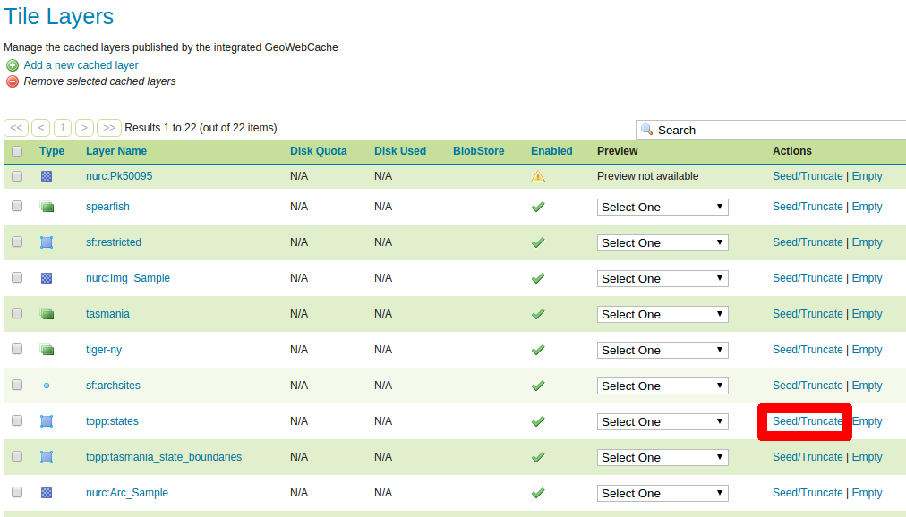
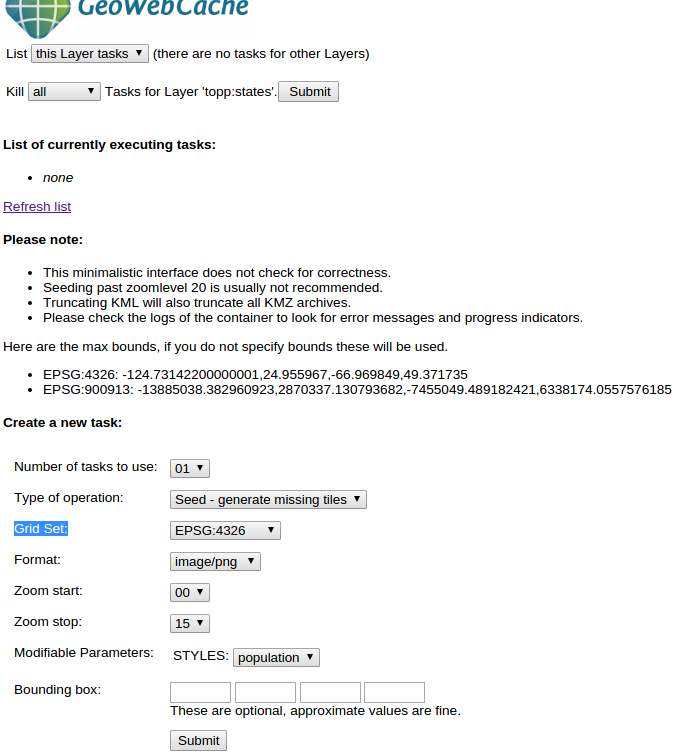
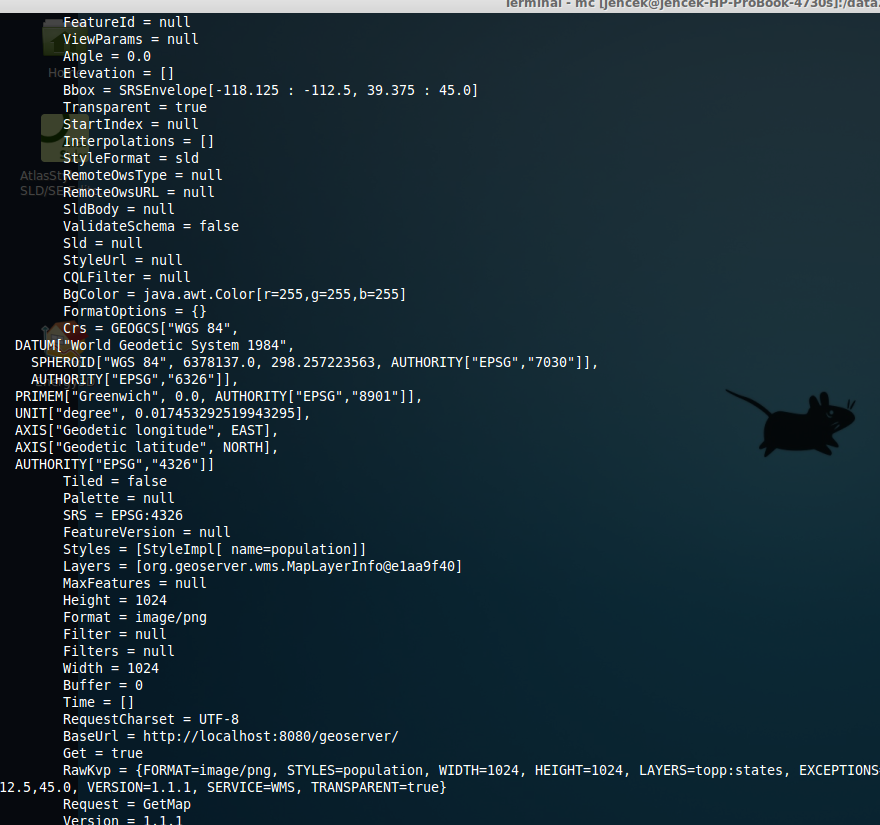
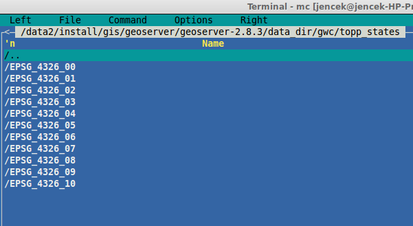

.. index::
   single: Generování dlaždic

.. _definicer:

Generování dlaždic
------------------

Genrování dlaždic můžeme spustit pomocí odkazu `Tile Layers` v sekci `Tile Caching`. 
Zde pak u vrstvy volíme možnost `Seed/Truncate`.

   Genrování dlaždic.

Nastavení generování
====================

Nastavení generování můžeme volit několik možností. Pokud máme více jader může se hodit zvolit více úloh
`Number of tasks to use`. Můžeme volit úrovně přiblížení na data (0 - celý svět, 15 - část obce) `Zoom start` a `Zoom end`.  Můžeme zvolit také jiný styl pro vykreselní `Modifiable Parameters`. Také můžeme omezit generování na výbrané území `Bounding box`. V neposlední řadě můžeme zvolit `Grid Set`. Také můžeme volit zda chceme jen vygenerovat chybějící dlaždice nebo kompletně přegeneovat můžeme zvolit v možnosti `Type of operation`.

   Nastavení generování.

Po spuštění tlačítkem Submit se na pozadí spustí generování. Jeho průběh můžeme sledovat buď v konzoli, kde je geoserver
spuštěn nebo v prohlížeči.

   Stav generování v konzoli.

.. note:: Na statickém obrázku to není vidět, ale server získává stovky požadavků za minutu a výsledky ukládá jako dlaždice do souborů.

.. figure:: images/stavtprohlizec.png

   Stav generování v prohlížeči.

Také je možné sledovat stav na disku. Data se ukládají do adresáře data_dir/gwc/názevvrstvy/souřsystém_úroveňpřiblížení/.

   Stav generování na disku.

   
Výstup
======
   
V případě, že se vše podaří je daná vrstva v podobě dlaždic k dispozici přes služby vybrané v konfiguraci. 
