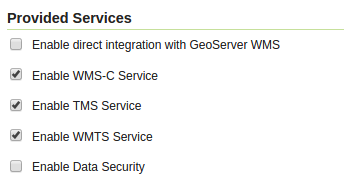
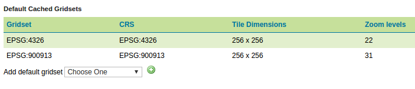

.. index::
   single: Nastavení dlaždic

.. _definicer:

Nastavení dlaždic
-----------------

Nastavení dlaždic je poměrně rozsáhlé, ale pro začátečníka není zas tak složité.
Komplikace mohou nastat v případě, že potřebujete např. nastavit vlastní
souřadnicové systémy pro generování dlaždic. Základní nastavení získáme pomocí
odkazu `Caching Defaults` v sekci `Tile Caching`. 

Provided Services
=================

V rámci sekce `Provided Services` je možné povolit nebo zakázat jednotlivé protokoly,
pomocí kterých jsou distribuovány dlaždice ke klientovi. Zajímavá je možnost 
`Enable direct integration with GeoServer WMS`, která umožňuje zaznamenávat cache v případě
práce s WMS. Výhodou je pak zrychlení funkce WMS služby. 

   Seznam služeb a integrace s WMS.
   
Formáty
=======
   
V sekci `Default Tile Image Formats for` je možno pro různé zdroje definovat formáty, ve kterých
se boud dlaždice generovat. 

.. figure:: images/formatst.png

   Formáty dlaždic.
   
Výchozí Gridsety
================
   
Také je možné nastavit výchozí Gridsety a jejich parametry. Obvykle si však vystačíme s již 
předpřipravenými Gridsety pro WGS84 a Google Mercator. 

   Gridsety

