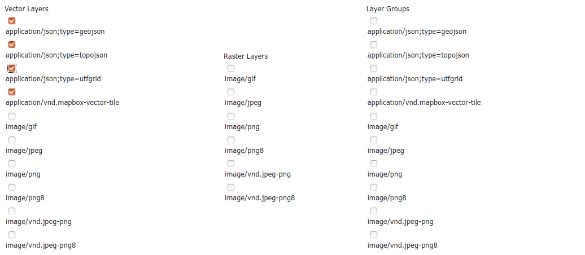

.. index::
   single: Vektorové dlaždice

.. _vector_tiles:

Vektorové dlaždice
------------------
Vektorové dlaždice jdou v Geoserveru generovat jenom z vektorových vrstev. Generovat vektorové dlaždice můžeme bez instalace pluginu ve formátu application/json;type=utfgrid . 

.. figure:: images/vector_geo.png

Pro další možnosti potřebujeme nainstalovat extenzi Vector Tiles. Najdeme ji na stránkách Geoserveru. Soubory z archivu uložíme do :file:`webapps/geoserver/WEB-INF/lib` 

Instalací extenzi nám přibyla možnost generovat vektorové dlaždice ve formátech application/json;type=geojson, application/json;type=topojson nebo application/vnd.mapbox-vector-tile. Rozdíli mezi formátmi GeoJSON a TopoJSON jsou popsány v materiálech ke školení Úvod do GIS https://training.gismentors.eu/open-source-gis/formaty/vektor.html
Formát application/vnd.mapbox-vector-tile generuje binární soubor s příponou *.pbf
Data ve vektorových dlaždicích jsou generalizované, čím nižší úroveň přiblížení, tým je generalizace větší.
