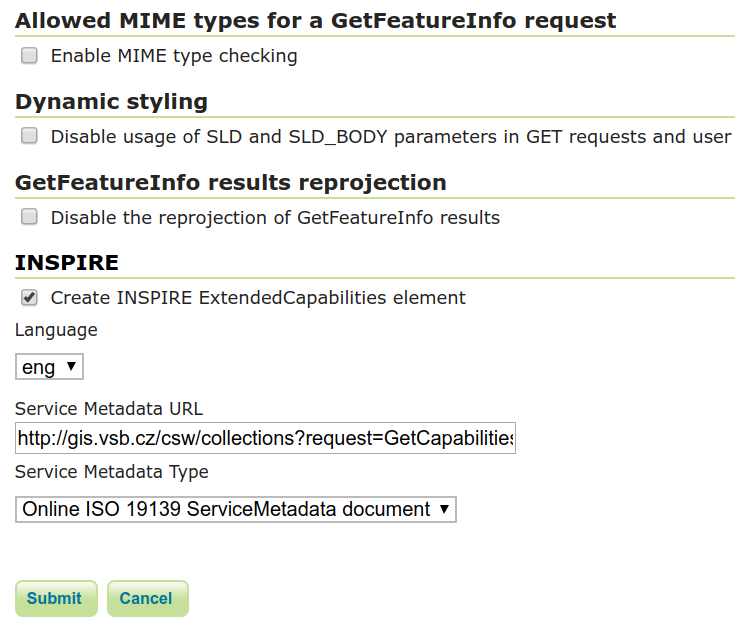
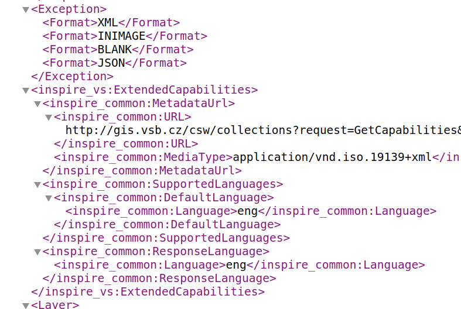
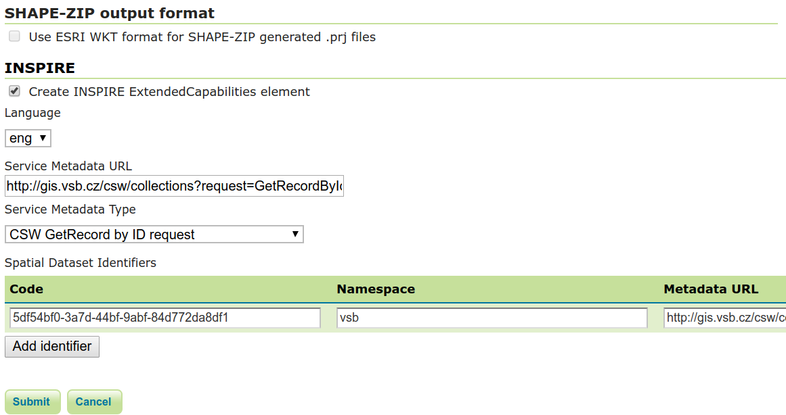
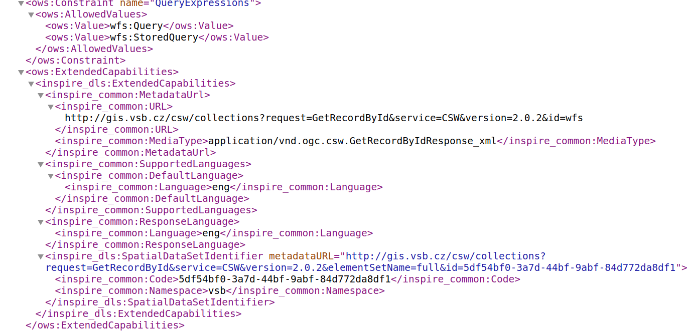

.. index::
   single: Nastavení rozšíření INSPIRE

.. _definicer:

Nastavení rozšíření INSPIRE
---------------------------

Rozšíření INSPIRE se projeví tak, že je možné konfigurovat některé další
prvky metadat, které jsou vyžadovány dle směrnice INSPIRE. 

Konfigurace metadat služby
==========================

V administraci serveru v sekci Services vybereme příslušnou službu,
jejíž metadata chceme konfigurovat.

.. figure:: images/services.png

   Sekce Services.

Konfigurace metadat služby WMS (WMTS)
=====================================

V nastavení metadat služby WMS (WMTS) pak na konci uvidíme možnost INSPIRE,
kterou když vybereme můžeme vyplnit link na metadata dle ISO 19139.

   Nastavení metadat INSPIRE.

Toto vyplnění se pak projeví v metadatech služby.

   Sekce metadat dle INSPIRE.

Konfigurace metadat služby WFS (WCS)
=====================================

V nastavení metadat služby WFS (WCS) je konfigurace trochu jiná než u WMS.
Zde je možné vyplnit také kódy jednotlivých datových sad.

   Nastavení metadat INSPIRE pro WFS (WCS).

Toto vyplnění se pak projeví v metadatech služby.

   Sekce metadat dle INSPIRE pro WFS (WCS).
