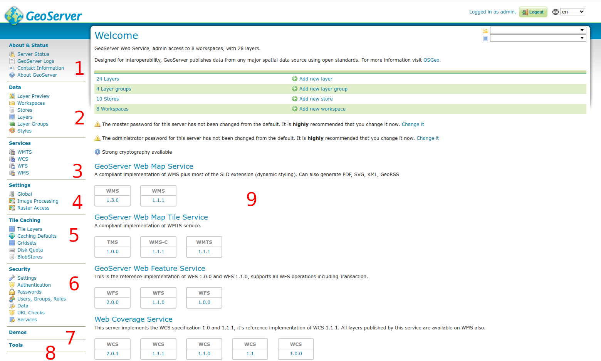

.. index::
   single: administrace

.. _administrace:

Administrace
------------

Pro práci s nástrojem GeoServer je možné využívat webové GUI, které umožňuje
konfigurovat řadu nastavení serveru. Zejména je možné měnit styly a přidávat nová data.

Jinou možností je využití `REST API`, které je však vhodné pro pokročilé uživatele.

Uživatelské rozhraní administrace serveru
=========================================

Uživatelské rozhraní je členěno na několik částí. Tyto jsou popsány
dále s odkazem na :numref:`admin`.  Pro vstup do administrace je nutné
se přihlásit. Implicitní uživatelské jméno je `admin` a heslo
`geoserver`.

.. _admin:

           
   Uživatelské rozhraní administrace serveru

About & Status
^^^^^^^^^^^^^^
(Na :numref:`admin` označena číslem 1) Sekce umožňující zobrazit informace o stavu serveru, zejména pak log serveru.
Dále je zde možné nastavit základní metadata serveru.

Data
^^^^
(Na :numref:`admin` označena číslem 2) Hlavní sekce pro práci se styly a daty.

Services
^^^^^^^^
(Na :numref:`admin` označena číslem 3) Sekce umožňující konfiguraci protokolů WMS, WFS a WCS. 

Settings
^^^^^^^^
(Na :numref:`admin` označena číslem 4) Sekce pro pokročilé uživatele pro optimalizaci práce s rastrovými daty.

Tile Caching
^^^^^^^^^^^^
(Na :numref:`admin` označena číslem 5) Sekce pro konfiguraci kešování obsahu pomocí dlaždic.

Security
^^^^^^^^
(Na :numref:`admin` označena číslem 6) Sekce pro konfiguraci uživatelů a práv přístupu.

Demos
^^^^^
(Na :numref:`admin` označena číslem 7) Výborná sekce s různými příklady a nástroji.

Tools
^^^^^
(Na :numref:`admin` označena číslem 8) Zatím obsahuje pouze nástroj pro nahrání testovacích dat.

Service Capabilities
^^^^^^^^^^^^^^^^^^^^
(Na :numref:`admin` označena číslem 9) Schopnosti služeb, které server poskytuje.
