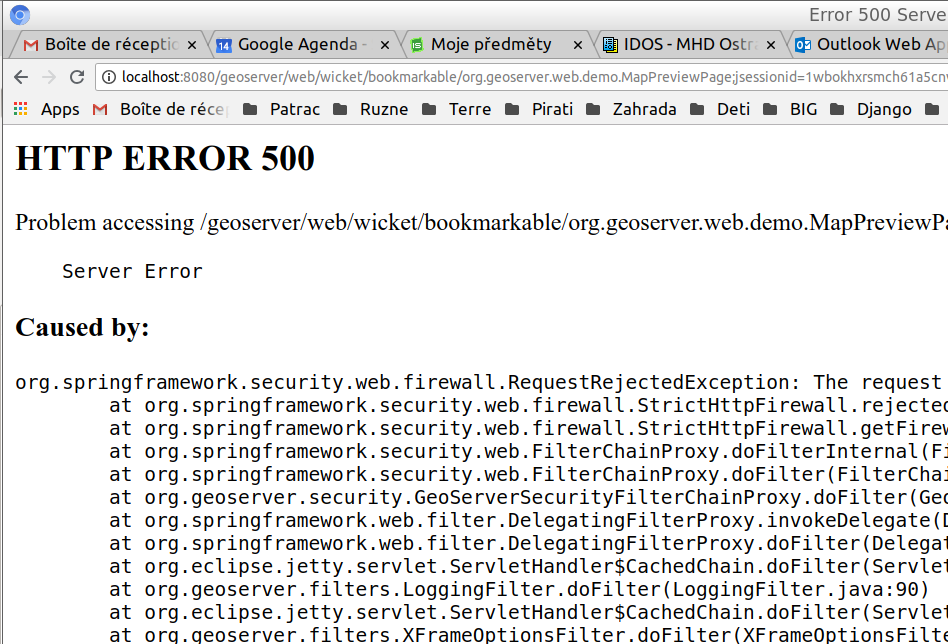

Úvod do systému GeoServer
-------------------------

Po úspěšné instalaci systému GeoServer (dle návodu
:doc:`../instalace/index`) je možné jej spustit a začít okamžitě
pracovat.

.. index::
   single: spuštění GeoServer

Spuštění systému GeoServer
==========================

.. note:: Pokud jste instalovali GeoServer v rámci
   :doc:`../instalace/docker`, tak byl GeoServer automaticky spuštěn
   při startu kontejneru. Tuto část můžete přeškočit.

Úspěšně nainstalovaný mapový server by měl být spustitelný z příkazové
řádky pomocí příkazu :file:`startup.sh` (pro Linux) nebo spuštěním
dávkového souboru :file:`startup.bat` (pro Windows) umístěného v
adresáři :file:`bin`.  V obou případech čekáme až server naběhne
zcela.

.. notecmd:: Spuštění GeoServer

   Příklad spuštění na OS Linux:
   
   .. code-block:: bash
		
      ./bin/startup.sh

   Příklad spuštění na OS MS Windows:
   
   .. code-block:: bash
		
      .\bin\startup.bat
      
.. raw:: latex

	 \newpage

.. figure:: images/linux_start.png

   Spuštění systému GeoServer v Ubuntu.

Server je spuštěn v okamžiku, kdy se objeví informační hláška:

``INFO:  Started SelectChannelConnector@0.0.0.0:8080``.

Možné problémy a jejich řešení
==============================

Obvyklým problémem je nespuštění serveru s chybovou hláškou ``Address
already in use``. To znamená, že na portu `8080`, kde se server
startuje, již něco běží.

V takovém případě je nutné změnit port pro start serveru.  Toto se
dělá v souboru :file:`etc/jetty.xml` nahrazením portu `8080` jiným
číslem např. `25000`. U portu s čísly většími než `20000` se dá
očekávat, že jsou volné.

Ověření běhu
============

Informační hláška ``INFO: Started
SelectChannelConnector@0.0.0.0:8080`` bohužel nemusí znamenat, že
server běží. Toto je nutné ověřit. Ověření prodeme ve webovém
prohlížeči zadáním adresy: http://localhost:8080/geoserver/

.. note:: V případě, že jste změnili port, je nutné i zde zadat jiné číslo portu než 8080.

.. raw:: latex

	 \newpage

.. figure:: images/welcome.png
   :class: middle
           
   Ověření spuštění systému GeoServer.

V případě, že se objeví uvítací obrazovka je systém pravděpodobně spuštěn.
Přesto je vhodné provést ještě jedno ověření. Ověření se realizuje výběrem Layer Preview
a výběrem možnosti Open Layers u vrstvy `sf:archsites`. Pokud se objeví mapa bodové vrstvy, je
systém spuštěn.

.. raw:: latex

	 \newpage

.. figure:: images/layer-preview.png
   :class: middle
           
   Ověření spuštění systému GeoServer pomocí vizualizace vrstvy geodat.
   
.. raw:: latex

	 \newpage

.. figure:: images/archsites.png

   Vrstva sf:archsites.

.. note:: Toto ověření je vhodné realizovat vždy po restartu serveru.

Možné problémy a jejich řešení
==============================

Obvyklým problémem je nespuštění serveru s chybovou hláškou ``HTTP
ERROR 500. Caused by:
org.springframework.security.web.firewall.RequestRejectedException``.

   Chyba 500.

Řešením je úprava konfigurace serveru jetty. Řeší se přidáním XML
elementu do konfigurace.  Konfigurační soubor se nachází v
:file:`webapps/geoserver/WEB-INF/web.xml`.

Na konec souboru před značku ``</web-app>`` vložíme následující tři řádky.

.. code-block:: xml

  <session-config>
  	<tracking-mode>COOKIE</tracking-mode>
  </session-config>
