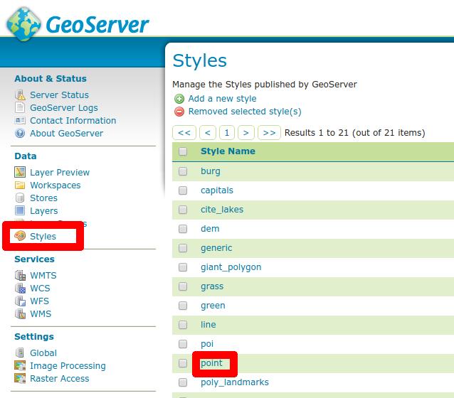
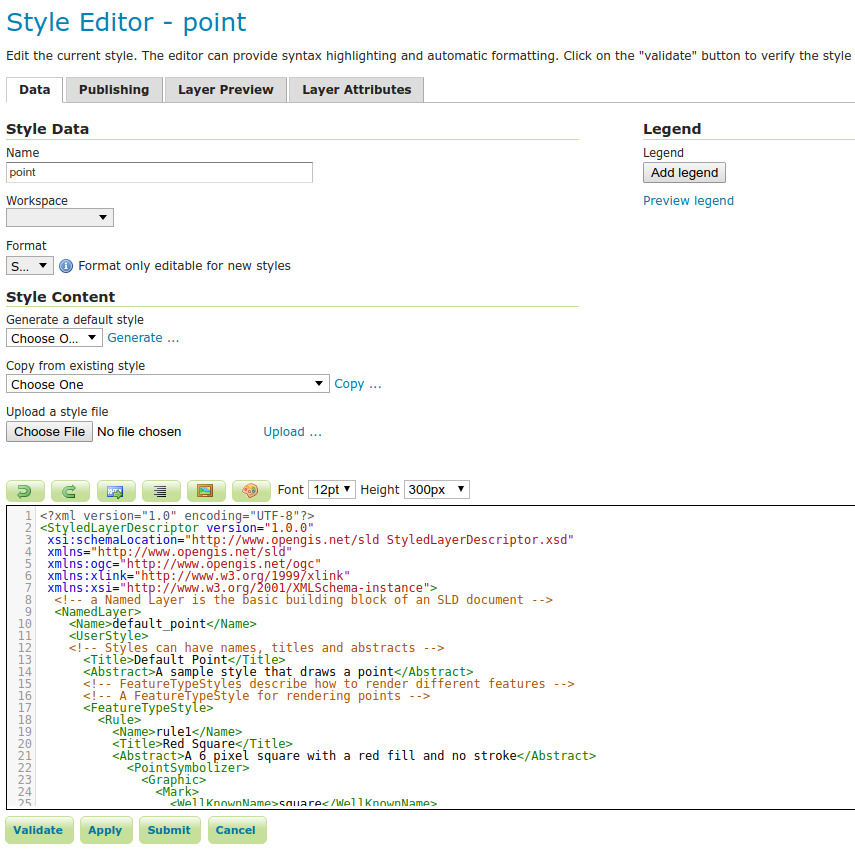
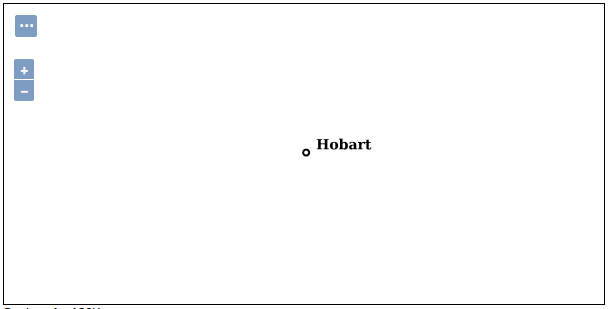

.. index::
   single: Jednoduchý styl

.. _jednoduchy:

Jednoduchý styl
----------------

Styly jsou psány v jazyce `Styled Layer Descriptor`. Jde o jazyk využívající 
syntaxi jazyka XML. 

Editace je možná v jakémkoli textovém editoru. Editace je možná i v integrovaném 
www editoru přímo v administraci nástroje GeoServer.

Styly je možné také vytvářet v nástrojích jako je AtlasStyler, QGIS, OpenJUMP nebo uDIG.

.. note:: Pro získání kompatibilních stylů z QGISu je nutné použít QGIS 3.0 nebo novější a GeoServer 2.13.x nebo novější. 

Základní bodový styl
====================

Velmi jednoduchý bodový styl je styl použitý pro vrstvu `sf:archsites`. Jedná se o styl `point`.
Styl si zobrazíme pomocí sekce `Data`, volba `Styles` a vybereme styl `point`.

   Styl point
   
Styl je možné přímo editovat. Před uložením změn je vhodné použít tlačítko `Validate`, které nám ověří zda máme správnou syntaxi.

   Editace stylu
   
.. code-block:: xml

   <?xml version="1.0" encoding="ISO-8859-1"?>
   <StyledLayerDescriptor version="1.0.0" 
    xsi:schemaLocation="http://www.opengis.net/sld StyledLayerDescriptor.xsd" 
    xmlns="http://www.opengis.net/sld" 
    xmlns:ogc="http://www.opengis.net/ogc" 
    xmlns:xlink="http://www.w3.org/1999/xlink" 
    xmlns:xsi="http://www.w3.org/2001/XMLSchema-instance">
     <!-- a Named Layer is the basic building block of an SLD document -->
     <NamedLayer>
       <Name>default_point</Name>
       <UserStyle>
       <!-- Styles can have names, titles and abstracts -->
         <Title>Default Point</Title>
         <Abstract>A sample style that draws a point</Abstract>
         <!-- FeatureTypeStyles describe how to render different features -->
         <!-- A FeatureTypeStyle for rendering points -->
         <FeatureTypeStyle>
           <Rule>
             <Name>rule1</Name>
             <Title>Red Square</Title>
             <Abstract>A 6 pixel square with a red fill and no stroke</Abstract>
               <PointSymbolizer>
                 <Graphic>
                   <Mark>
                     <WellKnownName>square</WellKnownName>
                        <Fill>
                       <CssParameter name="fill">#FF0000</CssParameter>
                     </Fill>
                   </Mark>
                 <Size>6</Size>
               </Graphic>
             </PointSymbolizer>
           </Rule>
         </FeatureTypeStyle>
       </UserStyle>
     </NamedLayer>
   </StyledLayerDescriptor>

.. figure:: images/circle.png

   Styl circle

Rule
^^^^

Hlavní částí stylu jsou pravidla (`Rule`). V naší ukázce je pouze jedno pravidlo.
Pravidla jsou pojmenována a obsahují informaci jak se má skupina objektů vykreslit.
V našem případě se daným pravidlem vykreslí všechny objekty.

PointSymbolizer
^^^^^^^^^^^^^^^

`PointSymbolizer` slouží k vykreslení bodů. V rámci definice je pak definována grafika (`Graphic`),
která bude použita.

Mark
^^^^

V našem případě jde o grafiku definovanou pomocí `WellKnownName` a `Fill`. `WellKnownName` udává symbol 
a `Fill` barvu výplně symbolu. `WellKnownName` může mít hodnoty:

* square
* circle
* triangle
* star
* cross
* x

Na další možnosti stylování se můžete podívat do dokumentace ku GeoServeru na stránce : https://docs.geoserver.org/stable/en/user/styling/sld/cookbook/points.html

Základní liniový styl
=====================

Podobně jednoduchý styl jako je pro bodovou vrstvu `point` je pro liniovou vrstvu styl `simple_streams`. Používá ho vrstva `sf:streams`. 

.. code-block:: xml

   <?xml version="1.0" encoding="UTF-8"?>
   <StyledLayerDescriptor version="1.0.0" xmlns="http://www.opengis.net/sld" 
      xmlns:ogc="http://www.opengis.net/ogc"
     xmlns:xlink="http://www.w3.org/1999/xlink" 
      xmlns:xsi="http://www.w3.org/2001/XMLSchema-instance"
     xsi:schemaLocation="http://www.opengis.net/sld 
      http://schemas.opengis.net/sld/1.0.0/StyledLayerDescriptor.xsd">
     <NamedLayer>
       <Name>Simple Streams</Name>
       <UserStyle>
         <Title>Default Styler for streams segments</Title>
         <Abstract>Blue lines, 2px wide</Abstract>
         <FeatureTypeStyle>
           <FeatureTypeName>Feature</FeatureTypeName>
           <Rule>
             <Title>Streams</Title>
             <LineSymbolizer>
               <Stroke>
                 <CssParameter name="stroke">
                   <ogc:Literal>#003EBA</ogc:Literal>
                 </CssParameter>
                 <CssParameter name="stroke-width">
                   <ogc:Literal>2</ogc:Literal>
                 </CssParameter>
               </Stroke>
             </LineSymbolizer>
           </Rule>
         </FeatureTypeStyle>
       </UserStyle>
     </NamedLayer>
   </StyledLayerDescriptor>

.. figure:: images/polyline.png

   Styl simple_streams

LineSymbolizer
^^^^^^^^^^^^^^

Podobně jako PointSymbolizer slouží k vykreslení bodu, tak LineSymbolizer slouží k vykreslení linie. Místo grafiky se zde definuje tah (`Stroke`).

Stroke
^^^^^^^^^^^^^^

V našem případe definujeme tah pomocí dvou parametrů. Jeden je `stroke`, který určuje barvu a druhý je `stroke-width` který určuje šírku linie. Dále můžeme použít parametr `stroke-linecap` který určuje tvar linie. 

* butt
* round
* square

Na další možnosti stylování se můžete podívat do dokumentace ku GeoServeru na stránce : https://docs.geoserver.org/stable/en/user/styling/sld/cookbook/lines.html

Základní polygonový styl
========================

Jednoduchý polygonový styl je `polygon`.

.. code-block:: xml

   <?xml version="1.0" encoding="UTF-8"?>
   <StyledLayerDescriptor version="1.0.0" 
    xsi:schemaLocation="http://www.opengis.net/sld StyledLayerDescriptor.xsd" 
    xmlns="http://www.opengis.net/sld" 
    xmlns:ogc="http://www.opengis.net/ogc" 
    xmlns:xlink="http://www.w3.org/1999/xlink" 
    xmlns:xsi="http://www.w3.org/2001/XMLSchema-instance">
     <!-- a Named Layer is the basic building block of an SLD document -->
     <NamedLayer>
       <Name>default_polygon</Name>
       <UserStyle>
       <!-- Styles can have names, titles and abstracts -->
         <Title>Default Polygon</Title>
         <Abstract>A sample style that draws a polygon</Abstract>
         <!-- FeatureTypeStyles describe how to render different features -->
         <!-- A FeatureTypeStyle for rendering polygons -->
         <FeatureTypeStyle>
           <Rule>
             <Name>rule1</Name>
             <Title>Gray Polygon with Black Outline</Title>
             <Abstract>A polygon with a gray fill and a 1 pixel black outline</Abstract>
             <PolygonSymbolizer>
               <Fill>
                 <CssParameter name="fill">#AAAAAA</CssParameter>
               </Fill>
               <Stroke>
                 <CssParameter name="stroke">#000000</CssParameter>
                 <CssParameter name="stroke-width">1</CssParameter>
               </Stroke>
             </PolygonSymbolizer>
           </Rule>
         </FeatureTypeStyle>
       </UserStyle>
     </NamedLayer>
   </StyledLayerDescriptor>

.. figure:: images/polygone.png

   Styl polygone

PolygonSymbolizer
^^^^^^^^^^^^^^^^^

Podobně jako PointSymbolizer slouží k vykreslení bodu, tak PolygonSymbolizer slouží k vykreslení polygonu. Polygon se vykresluje pomocí dvou parametrů. `Fill` a `Stroke`. 

Fill
^^^^

Slouží k nastavení výplně polygonu.

Stroke
^^^^^^

Slouží k nastavení zobrazení hranice polygonu. Nastavuje se stejně jako stylu linie
.
Na další možnosti stylování se můžete podívat do dokumentace ku GeoServeru na stránce : https://docs.geoserver.org/stable/en/user/styling/sld/cookbook/polygons.html

Popisky
=========

Další ze základních možností stylování je vytvoření popisku. Popisky můžeme vytvářet pro všechny typy vrstev. 

.. code-block:: xml

	<?xml version="1.0" encoding="UTF-8"?>
	<StyledLayerDescriptor version="1.0.0"
	  xsi:schemaLocation="http://www.opengis.net/sld 
    http://schemas.opengis.net/sld/1.0.0/StyledLayerDescriptor.xsd" 
	  xmlns="http://www.opengis.net/sld"
	  xmlns:ogc="http://www.opengis.net/ogc" 
	  xmlns:xlink="http://www.w3.org/1999/xlink" 
	  xmlns:xsi="http://www.w3.org/2001/XMLSchema-instance">
	  <NamedLayer>
	    <Name>capitals</Name>
	    <UserStyle>
	      <Name>capitals</Name>
	      <Title>Capital cities</Title>
	      <FeatureTypeStyle>
		<Rule>
		  <Title>Capitals</Title>
		<TextSymbolizer>
		  <Label>
		    <ogc:PropertyName>CITY_NAME</ogc:PropertyName>
		  </Label>
		  
		    <CssParameter name="font-family">Times New Roman</CssParameter>
		    <CssParameter name="font-style">bold</CssParameter>
		    <CssParameter name="font-size">14</CssParameter>
		  
		  <LabelPlacement>
		    <PointPlacement>
		      <AnchorPoint>
		        <AnchorPointX>0</AnchorPointX>
		        <AnchorPointY>0</AnchorPointY>
		      </AnchorPoint>
		      <Displacement>
		        <DisplacementX>10</DisplacementX>
		        <DisplacementY>0</DisplacementY>
		      </Displacement>
		    </PointPlacement>
		  </LabelPlacement>
		  </TextSymbolizer>
		  <PointSymbolizer>
		    <Graphic>
		      <Mark>
		        <WellKnownName>circle</WellKnownName>
		        <Fill>
		          <CssParameter name="fill">
		            <ogc:Literal>#FFFFFF</ogc:Literal>
		          </CssParameter>
		        </Fill>
		        <Stroke>
		          <CssParameter name="stroke">
		            <ogc:Literal>#000000</ogc:Literal>
		          </CssParameter>
		          <CssParameter name="stroke-width">
		            <ogc:Literal>2</ogc:Literal>
		          </CssParameter>
		        </Stroke>
		      </Mark>
		      <Opacity>
		        <ogc:Literal>1.0</ogc:Literal>
		      </Opacity>
		      <Size>
		        <ogc:Literal>6</ogc:Literal>
		      </Size>

		    </Graphic>
		  </PointSymbolizer>
		</Rule>
	      </FeatureTypeStyle>
	    </UserStyle>
	  </NamedLayer>
	</StyledLayerDescriptor>

   Styl label

TextSymbolizer
^^^^^^^^^^^^^^

Slouží k vzkreslení popisků. Základními parametrama pro `TextSymbolizer` jsou `Label` a `Fill`

Label
^^^^^

Slouží k zadefinování atribůtu, z kterého se čerpají data pro popisky

Fill
^^^^

Slouží k nastavění barvy popisku.

AnchorPoint
^^^^^^^^^^^ 

Určuje pozici vztažného bodu popisku. Může nadobůdat hodnoty 0 až 1 pro X a Y. Hodnota 0,0 znamená že vzťažný bod je v levém dolním rohu a hodnota 1,1 znamená že je v pravém horním rohu. 

.. figure:: images/anchor.png

   Pozice popisku

Displacement
^^^^^^^^^^^^

Určuje odsazení popisku.

Úkoly
=====

Editujte styl v rámci WWW editoru. Změňte následující parametry. Styl uložte a zkuste
přes `Layer Preview` obnovit mapu.

.. note:: Pokud se nic nezměnilo, pak zkuste změnit výřez mapy. Někdy je starý obrázek v paměti prohlížeče.

WellKnownName
^^^^^^^^^^^^^
`Square` změňte na `circle`.

Fill
^^^^

Barvy výplně změňte z #FF0000 (červená) na #00FF00 (zelená).

Řešení úkolů
============

WellKnownName
^^^^^^^^^^^^^

.. code-block:: xml

   <?xml version="1.0" encoding="ISO-8859-1"?>
   <StyledLayerDescriptor version="1.0.0" 
    xsi:schemaLocation="http://www.opengis.net/sld StyledLayerDescriptor.xsd" 
    xmlns="http://www.opengis.net/sld" 
    xmlns:ogc="http://www.opengis.net/ogc" 
    xmlns:xlink="http://www.w3.org/1999/xlink" 
    xmlns:xsi="http://www.w3.org/2001/XMLSchema-instance">
     <!-- a Named Layer is the basic building block of an SLD document -->
     <NamedLayer>
       <Name>default_point</Name>
       <UserStyle>
       <!-- Styles can have names, titles and abstracts -->
         <Title>Default Point</Title>
         <Abstract>A sample style that draws a point</Abstract>
         <!-- FeatureTypeStyles describe how to render different features -->
         <!-- A FeatureTypeStyle for rendering points -->
         <FeatureTypeStyle>
           <Rule>
           <Name>rule1</Name>
             <Title>Red Circle</Title>
             <Abstract>A 6 pixel circle with a red fill and no stroke</Abstract>
               <PointSymbolizer>
                 <Graphic>
                   <Mark>
                     <WellKnownName>circle</WellKnownName>
                     <Fill>
                       <CssParameter name="fill">#FF0000</CssParameter>
                     </Fill>
                   </Mark>
                 <Size>6</Size>
               </Graphic>
             </PointSymbolizer>
           </Rule>
         </FeatureTypeStyle>
       </UserStyle>
     </NamedLayer>
   </StyledLayerDescriptor>

.. figure:: images/circle.png

   Styl circle

Fill
^^^^
.. code-block:: xml

   <?xml version="1.0" encoding="ISO-8859-1"?>
   <StyledLayerDescriptor version="1.0.0" 
    xsi:schemaLocation="http://www.opengis.net/sld StyledLayerDescriptor.xsd" 
    xmlns="http://www.opengis.net/sld" 
    xmlns:ogc="http://www.opengis.net/ogc" 
    xmlns:xlink="http://www.w3.org/1999/xlink" 
    xmlns:xsi="http://www.w3.org/2001/XMLSchema-instance">
     <!-- a Named Layer is the basic building block of an SLD document -->
     <NamedLayer>
       <Name>default_point</Name>
       <UserStyle>
       <!-- Styles can have names, titles and abstracts -->
         <Title>Default Point</Title>
         <Abstract>A sample style that draws a point</Abstract>
         <!-- FeatureTypeStyles describe how to render different features -->
         <!-- A FeatureTypeStyle for rendering points -->
         <FeatureTypeStyle>
           <Rule>
           <Name>rule1</Name>
             <Title>Green Circle</Title>
             <Abstract>A 6 pixel circle with a green fill and no stroke</Abstract>
               <PointSymbolizer>
                 <Graphic>
                   <Mark>
                     <WellKnownName>circle</WellKnownName>
                     <Fill>
                       <CssParameter name="fill">#00FF00</CssParameter>
                     </Fill>
                   </Mark>
                 <Size>6</Size>
               </Graphic>
             </PointSymbolizer>
           </Rule>
         </FeatureTypeStyle>
       </UserStyle>
     </NamedLayer>
   </StyledLayerDescriptor>

.. figure:: images/greencircle.png

   Styl green circle

