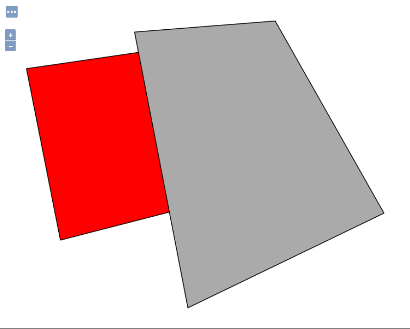
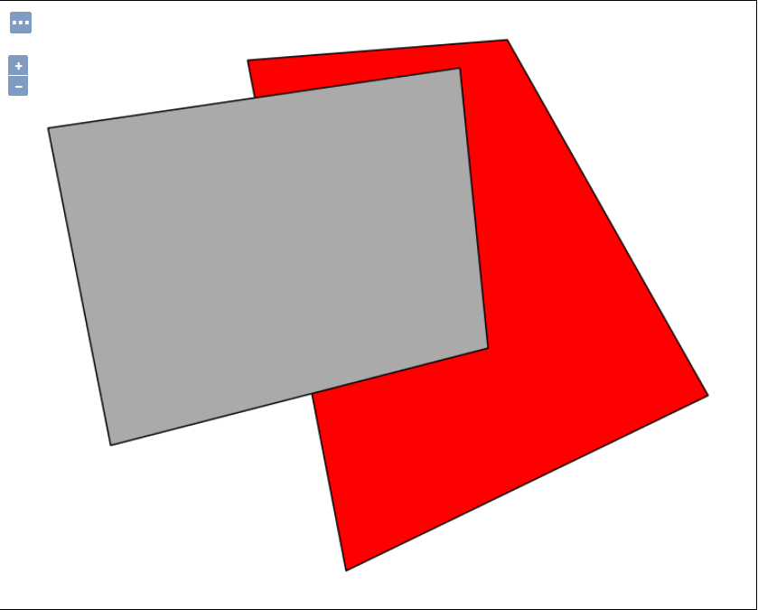

.. index::
   single: Stylování vrstev s překryvem

.. prekryv:

Stylování vrstev s překryvem
-----------------------------

Může se nám stát, že máme vrstvu kde u překrývajících se prvků potřebujeme grafikou vyjádřit jejich prioritu. Typickým příkladem můžou být komunikace. Ty potřebujeme vykreslovat od nejnižších kategorií, tak aby na vrchu byli ty nejdůležitější kategorie. Na ukázku jsem si připravil jednoduchou vrstvu, kde jsou dvě překrývající se polygony  

Stylování přes Rule
====================

V kapitole Kartogram jsme měli ukázaný styl `population`, kde jsme v jednom `FeatureTypeStyle` měli několik `Rule`. Tohle může použít v případě, že nám nezáleží na pořadí vykreslování. Ukážeme si zde dva jednoduché styly. Rozdíl je v tom, že v prvním style je v prvním `Rule` filtr na hodnotu 1 a v druhém na hodnotu 2.

Styl 1
^^^^^^

.. code-block:: xml

  <?xml version="1.0" encoding="UTF-8"?>
  <StyledLayerDescriptor version="1.0.0" 
   xsi:schemaLocation="http://www.opengis.net/sld StyledLayerDescriptor.xsd" 
   xmlns="http://www.opengis.net/sld" 
   xmlns:ogc="http://www.opengis.net/ogc" 
   xmlns:xlink="http://www.w3.org/1999/xlink" 
   xmlns:xsi="http://www.w3.org/2001/XMLSchema-instance">
    <!-- a Named Layer is the basic building block of an SLD document -->
    <NamedLayer>
      <Name>default_polygon</Name>
      <UserStyle>
      <!-- Styles can have names, titles and abstracts -->
        <Title>Default Polygon</Title>
        <Abstract>A sample style that draws a polygon</Abstract>
        <!-- FeatureTypeStyles describe how to render different features -->
        <!-- A FeatureTypeStyle for rendering polygons -->
        <FeatureTypeStyle>       
          <Rule>
            <Title>Red Polygon with Black Outline</Title>
            <Abstract>A polygon with a red fill and a 1 pixel black outline</Abstract>
            <ogc:Filter>
              <ogc:PropertyIsEqualTo>
               <ogc:PropertyName>id</ogc:PropertyName>
               <ogc:Literal>1</ogc:Literal>
              </ogc:PropertyIsEqualTo>
            </ogc:Filter>
            <PolygonSymbolizer>
              <Fill>
                <CssParameter name="fill">#ff0000</CssParameter>
              </Fill>
              <Stroke>
                <CssParameter name="stroke">#000000</CssParameter>
                <CssParameter name="stroke-width">1</CssParameter>
              </Stroke>
             </PolygonSymbolizer>
          </Rule>
          <Rule>
            <Title>Gray Polygon with Black Outline</Title>
            <Abstract>A polygon with a gray fill and a 1 pixel black outline</Abstract>
            <ogc:Filter>
              <ogc:PropertyIsEqualTo>
              <ogc:PropertyName>id</ogc:PropertyName>
              <ogc:Literal>2</ogc:Literal>
             </ogc:PropertyIsEqualTo>
            </ogc:Filter>
            <PolygonSymbolizer>
              <Fill>
                <CssParameter name="fill">#AAAAAA</CssParameter>
              </Fill>
              <Stroke>
                <CssParameter name="stroke">#000000</CssParameter>
                <CssParameter name="stroke-width">1</CssParameter>
              </Stroke>
            </PolygonSymbolizer>
          </Rule>
        </FeatureTypeStyle>
      </UserStyle>
    </NamedLayer>
  </StyledLayerDescriptor>
  
  

   Styl 1

Styl 2
^^^^^^

.. code-block:: xml 

  <?xml version="1.0" encoding="UTF-8"?>
  <StyledLayerDescriptor version="1.0.0" 
   xsi:schemaLocation="http://www.opengis.net/sld StyledLayerDescriptor.xsd" 
   xmlns="http://www.opengis.net/sld" 
   xmlns:ogc="http://www.opengis.net/ogc" 
   xmlns:xlink="http://www.w3.org/1999/xlink" 
   xmlns:xsi="http://www.w3.org/2001/XMLSchema-instance">
    <!-- a Named Layer is the basic building block of an SLD document -->
    <NamedLayer>
      <Name>default_polygon</Name>
      <UserStyle>
      <!-- Styles can have names, titles and abstracts -->
        <Title>Default Polygon</Title>
        <Abstract>A sample style that draws a polygon</Abstract>
        <!-- FeatureTypeStyles describe how to render different features -->
        <!-- A FeatureTypeStyle for rendering polygons -->
        <FeatureTypeStyle>       
          <Rule>
            <Title>Gray Polygon with Black Outline</Title>
            <Abstract>A polygon with a gray fill and a 1 pixel black outline</Abstract>
            <ogc:Filter>
              <ogc:PropertyIsEqualTo>
              <ogc:PropertyName>id</ogc:PropertyName>
              <ogc:Literal>2</ogc:Literal>
             </ogc:PropertyIsEqualTo>
            </ogc:Filter>
            <PolygonSymbolizer>
              <Fill>
                <CssParameter name="fill">#AAAAAA</CssParameter>
              </Fill>
              <Stroke>
                <CssParameter name="stroke">#000000</CssParameter>
                <CssParameter name="stroke-width">1</CssParameter>
              </Stroke>
            </PolygonSymbolizer>
          </Rule>
          <Rule>
            <Title>Red Polygon with Black Outline</Title>
            <Abstract>A polygon with a red fill and a 1 pixel black outline</Abstract>
            <ogc:Filter>
              <ogc:PropertyIsEqualTo>
               <ogc:PropertyName>id</ogc:PropertyName>
               <ogc:Literal>1</ogc:Literal>
              </ogc:PropertyIsEqualTo>
            </ogc:Filter>
            <PolygonSymbolizer>
              <Fill>
                <CssParameter name="fill">#ff0000</CssParameter>
              </Fill>
              <Stroke>
                <CssParameter name="stroke">#000000</CssParameter>
                <CssParameter name="stroke-width">1</CssParameter>
              </Stroke>
             </PolygonSymbolizer>
          </Rule>
        </FeatureTypeStyle>
      </UserStyle>
    </NamedLayer>
  </StyledLayerDescriptor> 

   Styl 2
  
Stylování přes různé FeatureTypeStyle
=====================================

Teď si ukážeme na stejné vrstvě případ, kde každé pravidlo `Rule` dáme do samostatného `FeatureTypeStyle`. V tomto případě, když přehodíme `FeatureTypeStyle`, tak se nám zobrazí prvky jinak překryté. 

Styl 1
^^^^^^

.. code-block:: xml

  <?xml version="1.0" encoding="UTF-8"?>
  <StyledLayerDescriptor version="1.0.0" 
   xsi:schemaLocation="http://www.opengis.net/sld StyledLayerDescriptor.xsd" 
   xmlns="http://www.opengis.net/sld" 
   xmlns:ogc="http://www.opengis.net/ogc" 
   xmlns:xlink="http://www.w3.org/1999/xlink" 
   xmlns:xsi="http://www.w3.org/2001/XMLSchema-instance">
    <!-- a Named Layer is the basic building block of an SLD document -->
    <NamedLayer>
      <Name>default_polygon</Name>
      <UserStyle>
      <!-- Styles can have names, titles and abstracts -->
        <Title>Default Polygon</Title>
        <Abstract>A sample style that draws a polygon</Abstract>
        <!-- FeatureTypeStyles describe how to render different features -->
        <!-- A FeatureTypeStyle for rendering polygons -->
        <FeatureTypeStyle>       
          <Rule>
            <Title>Red Polygon with Black Outline</Title>
            <Abstract>A polygon with a red fill and a 1 pixel black outline</Abstract>
            <ogc:Filter>
              <ogc:PropertyIsEqualTo>
               <ogc:PropertyName>id</ogc:PropertyName>
               <ogc:Literal>1</ogc:Literal>
              </ogc:PropertyIsEqualTo>
            </ogc:Filter>
            <PolygonSymbolizer>
              <Fill>
                <CssParameter name="fill">#ff0000</CssParameter>
              </Fill>
              <Stroke>
                <CssParameter name="stroke">#000000</CssParameter>
                <CssParameter name="stroke-width">1</CssParameter>
              </Stroke>
             </PolygonSymbolizer>
          </Rule>
        </FeatureTypeStyle>
        <FeatureTypeStyle>          
          <Rule>
            <Title>Gray Polygon with Black Outline</Title>
            <Abstract>A polygon with a gray fill and a 1 pixel black outline</Abstract>
            <ogc:Filter>
              <ogc:PropertyIsEqualTo>
              <ogc:PropertyName>id</ogc:PropertyName>
              <ogc:Literal>2</ogc:Literal>
             </ogc:PropertyIsEqualTo>
            </ogc:Filter>
            <PolygonSymbolizer>
              <Fill>
                <CssParameter name="fill">#AAAAAA</CssParameter>
              </Fill>
              <Stroke>
                <CssParameter name="stroke">#000000</CssParameter>
                <CssParameter name="stroke-width">1</CssParameter>
              </Stroke>
            </PolygonSymbolizer>
          </Rule>
        </FeatureTypeStyle>
      </UserStyle>
    </NamedLayer>
  </StyledLayerDescriptor>

   Styl 1
   
Styl 2
^^^^^^

.. code-block:: xml 

  <?xml version="1.0" encoding="UTF-8"?>
  <StyledLayerDescriptor version="1.0.0" 
   xsi:schemaLocation="http://www.opengis.net/sld StyledLayerDescriptor.xsd" 
   xmlns="http://www.opengis.net/sld" 
   xmlns:ogc="http://www.opengis.net/ogc" 
   xmlns:xlink="http://www.w3.org/1999/xlink" 
   xmlns:xsi="http://www.w3.org/2001/XMLSchema-instance">
    <!-- a Named Layer is the basic building block of an SLD document -->
    <NamedLayer>
      <Name>default_polygon</Name>
      <UserStyle>
      <!-- Styles can have names, titles and abstracts -->
        <Title>Default Polygon</Title>
        <Abstract>A sample style that draws a polygon</Abstract>
        <!-- FeatureTypeStyles describe how to render different features -->
        <!-- A FeatureTypeStyle for rendering polygons -->
        <FeatureTypeStyle>       
          <Rule>
            <Title>Gray Polygon with Black Outline</Title>
            <Abstract>A polygon with a gray fill and a 1 pixel black outline</Abstract>
            <ogc:Filter>
              <ogc:PropertyIsEqualTo>
              <ogc:PropertyName>id</ogc:PropertyName>
              <ogc:Literal>2</ogc:Literal>
             </ogc:PropertyIsEqualTo>
            </ogc:Filter>
            <PolygonSymbolizer>
              <Fill>
                <CssParameter name="fill">#AAAAAA</CssParameter>
              </Fill>
              <Stroke>
                <CssParameter name="stroke">#000000</CssParameter>
                <CssParameter name="stroke-width">1</CssParameter>
              </Stroke>
            </PolygonSymbolizer>
          </Rule>
        </FeatureTypeStyle>
        <FeatureTypeStyle>
          <Rule>
            <Title>Red Polygon with Black Outline</Title>
            <Abstract>A polygon with a red fill and a 1 pixel black outline</Abstract>
            <ogc:Filter>
              <ogc:PropertyIsEqualTo>
               <ogc:PropertyName>id</ogc:PropertyName>
               <ogc:Literal>1</ogc:Literal>
              </ogc:PropertyIsEqualTo>
            </ogc:Filter>
            <PolygonSymbolizer>
              <Fill>
                <CssParameter name="fill">#ff0000</CssParameter>
              </Fill>
              <Stroke>
                <CssParameter name="stroke">#000000</CssParameter>
                <CssParameter name="stroke-width">1</CssParameter>
              </Stroke>
             </PolygonSymbolizer>
          </Rule>
        </FeatureTypeStyle>
      </UserStyle>
    </NamedLayer>
  </StyledLayerDescriptor> 

   Styl 2 
