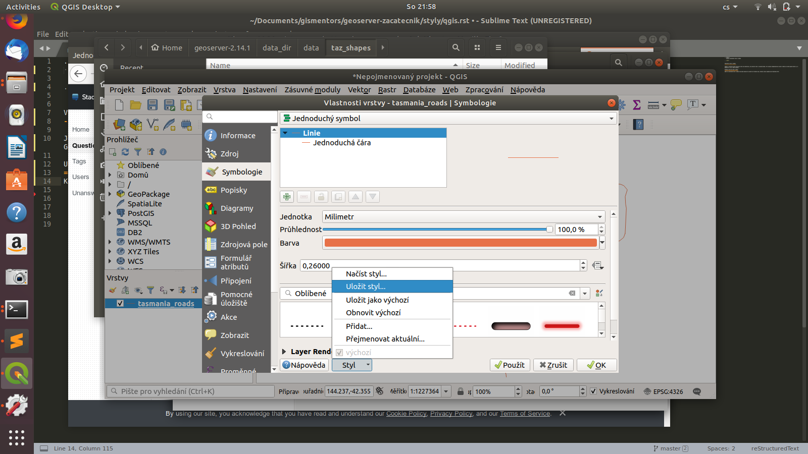
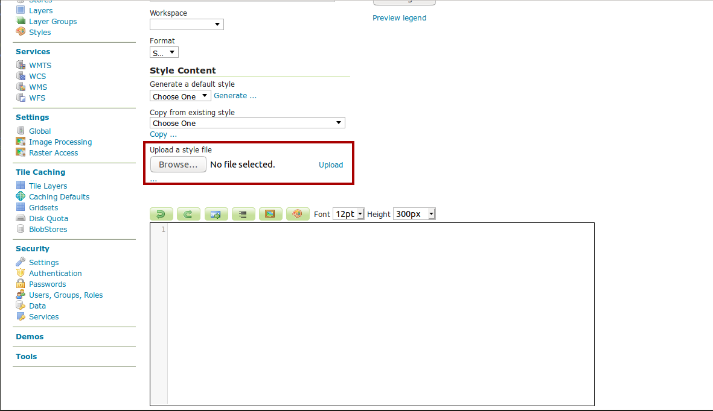

.. index::
   single: Vytvoření stylu v QGISu

.. _qgis:

Vytvoření stylu v QGISu
------------------------

Jednou z možností jako připravit styl pro Geoserver, je vytvořit styl v programe QGIS. Pro získání kompatibilních stylů z QGISu je nutné použít QGIS 3.x a GeoServer 2.13.x nebo novější.

Uložení stylu do SLD v QGISu
============================
Když si vytvoříme styl v QGISu tak máme možnost ho uložit do formátu SLD. Uložení stylu najdeme pod tlačítkem `Styl`

V položce Uložit styl vybere možnosť pro SLD a vybereme kam se soubor uloží. 

.. figure:: images/qgis_sld.png

Načtění SLD v GeoServeru
=========================
Při vztvoření stytlu v GeoServeru vybereme uložené SLD a dáme `Upload`. Do okna s kódem se nám načte SLD.

Bodová vrstva
=============
Základné stylování pro bodové vrstvy fungují. Bohužel u použití SVG ikon je potřeba udělat v SLD nějaké úpravy. 

SLD z QGISu
^^^^^^^^^^^
.. code-block:: xml

    <?xml version="1.0" encoding="UTF-8"?>
    <StyledLayerDescriptor xmlns="http://www.opengis.net/sld" version="1.1.0" xsi:schemaLocation="http://www.opengis.net/sld http://schemas.opengis.net/sld/1.1.0/StyledLayerDescriptor.xsd" xmlns:se="http://www.opengis.net/se" xmlns:xlink="http://www.w3.org/1999/xlink" xmlns:ogc="http://www.opengis.net/ogc" xmlns:xsi="http://www.w3.org/2001/XMLSchema-instance">
      <NamedLayer>
        <se:Name>tasmania_cities</se:Name>
        <UserStyle>
          <se:Name>tasmania_cities</se:Name>
          <se:FeatureTypeStyle>
            <se:Rule>
              <se:Name>Single symbol</se:Name>
              <se:PointSymbolizer>
                <se:Graphic>
                  <!--Parametric SVG-->
                  <se:ExternalGraphic>
                    <se:OnlineResource xlink:href="/usr/share/qgis/svg/gpsicons/plane.svg?fill=%23000000&amp;fill-opacity=1&amp;outline=%23ffffff&amp;outline-opacity=1&amp;outline-width=0" xlink:type="simple"/>
                    <se:Format>image/svg+xml</se:Format>
                  </se:ExternalGraphic>
                  <!--Plain SVG fallback, no parameters-->
                  <se:ExternalGraphic>
                    <se:OnlineResource xlink:href="gpsicons/plane.svg" xlink:type="simple"/>
                    <se:Format>image/svg+xml</se:Format>
                  </se:ExternalGraphic>
                  <!--Well known marker fallback-->
                  <se:Mark>
                    <se:WellKnownName>square</se:WellKnownName>
                    <se:Fill>
                      <se:SvgParameter name="fill">#000000</se:SvgParameter>
                    </se:Fill>
                    <se:Stroke>
                      <se:SvgParameter name="stroke">#ffffff</se:SvgParameter>
                      <se:SvgParameter name="stroke-width">0.5</se:SvgParameter>
                    </se:Stroke>
                  </se:Mark>
                  <se:Size>7</se:Size>
                </se:Graphic>
              </se:PointSymbolizer>
            </se:Rule>
          </se:FeatureTypeStyle>
        </UserStyle>
      </NamedLayer>
    </StyledLayerDescriptor>

* 1. odstránění nadbztečných částí

Odstráníme části pro  `Parametric SVG` a `Well known marker fallback`

.. code-block:: xml

                  <!--Parametric SVG-->
                  <se:ExternalGraphic>
                    <se:OnlineResource xlink:href="/usr/share/qgis/svg/gpsicons/plane.svg?fill=%23000000&amp;fill-opacity=1&amp;outline=%23ffffff&amp;outline-opacity=1&amp;outline-width=0" xlink:type="simple"/>
                    <se:Format>image/svg+xml</se:Format>
                  </se:ExternalGraphic>
                  <se:Mark>
                    <se:WellKnownName>square</se:WellKnownName>
                    <se:Fill>
                      <se:SvgParameter name="fill">#000000</se:SvgParameter>
                    </se:Fill>
                    <se:Stroke>
                      <se:SvgParameter name="stroke">#ffffff</se:SvgParameter>
                      <se:SvgParameter name="stroke-width">0.5</se:SvgParameter>
                    </se:Stroke>
                  </se:Mark>

* 2. uložení SVG

Zvolené SVG uložíme do do adresáře `styles` ve složce geoservera. Cestu k SVG nalezneme v části pro `Parametric SVG`. Před umístění SVG musíme vložit file:// Když budeme používat víc SVG ikon, tak můžeme si do adresáře `styles` všechny ikony z QGISu.

Výslední styl:

.. code-block:: xml

    <?xml version="1.0" encoding="UTF-8"?>
    <StyledLayerDescriptor xmlns="http://www.opengis.net/sld" version="1.1.0" xsi:schemaLocation="http://www.opengis.net/sld http://schemas.opengis.net/sld/1.1.0/StyledLayerDescriptor.xsd" xmlns:se="http://www.opengis.net/se" xmlns:xlink="http://www.w3.org/1999/xlink" xmlns:ogc="http://www.opengis.net/ogc" xmlns:xsi="http://www.w3.org/2001/XMLSchema-instance">
      <NamedLayer>
        <se:Name>tasmania_cities</se:Name>
        <UserStyle>
          <se:Name>tasmania_cities</se:Name>
          <se:FeatureTypeStyle>
            <se:Rule>
              <se:Name>Single symbol</se:Name>
              <se:PointSymbolizer>
                <se:Graphic>
                  <se:ExternalGraphic>
                    <se:OnlineResource xlink:href="file://plane.svg" xlink:type="simple"/>
                    <se:Format>image/svg+xml</se:Format>
                  </se:ExternalGraphic>
                  <se:Size>7</se:Size>
                </se:Graphic>
              </se:PointSymbolizer>
            </se:Rule>
          </se:FeatureTypeStyle>
        </UserStyle>
      </NamedLayer>
    </StyledLayerDescriptor>

