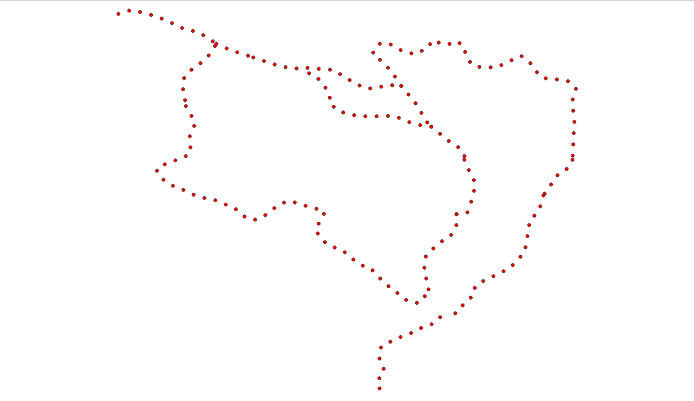
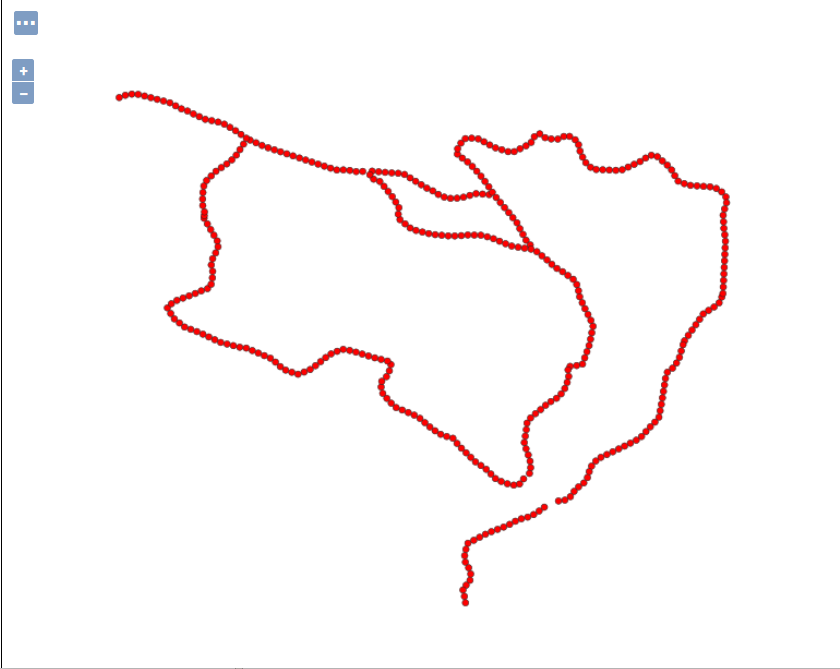
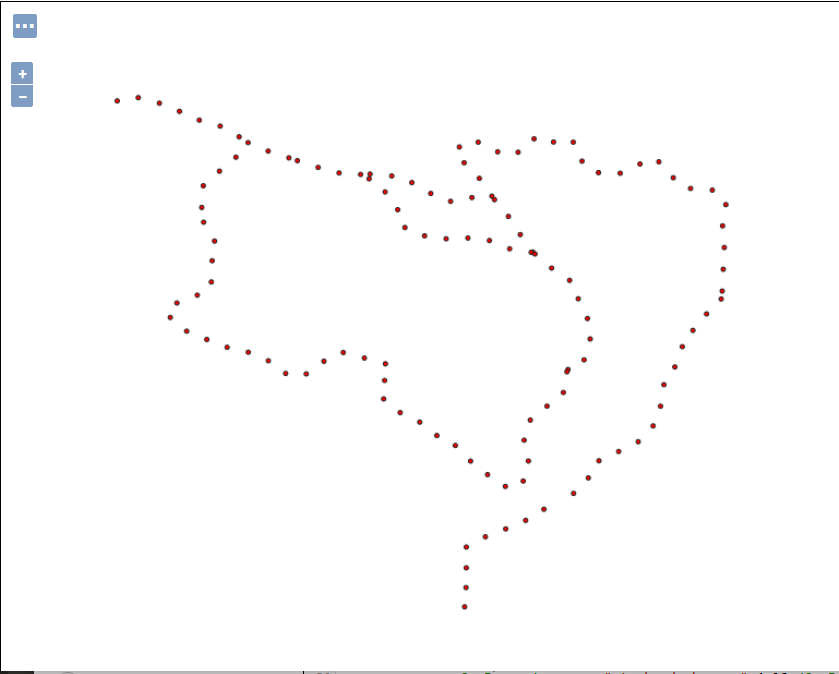

.. index::
   single: Vytvoření stylu v QGISu

.. _qgis:

Vytvoření stylu v QGISu
------------------------

Jednou z možností jako připravit styl pro Geoserver, je vytvořit styl v programe QGIS. Pro získání kompatibilních stylů z QGISu je nutné použít QGIS 3.x a GeoServer 2.13.x nebo novější.

Uložení stylu do SLD v QGISu
============================
Když si vytvoříme styl v QGISu tak máme možnost ho uložit do formátu SLD. Uložení stylu najdeme pod tlačítkem `Styl`

.. figure:: images/qgis_ulozeni.png

V položce Uložit styl vybere možnost pro SLD a vybereme kam se soubor uloží. 

.. figure:: images/qgis_sld.png

Načtení SLD v GeoServeru
=========================
Při vytvoření stylu v GeoServeru vybereme uložené SLD a dáme `Upload`. Do okna s kódem se nám načte SLD.

.. figure:: images/nacteni_sld.png

V QGISu si můžeme připravit dva základní styly. Buď máme kompletní styl v SLD nebo použije k stylu ještě nějaký doplňkový soubor. Tento soubor bude ve formátu SVG. 

Styl jenom v SLD
================

Tyto styly jsou kompletně v SLD. Jsou to převážně jednoduché styly, ale můžeme si připravit i komplexní styl. Je důležité styl v QGISu připravovat s hodnotami v pixelech. Protože SLD pracuje s pixely a ne s milimetry. Při uložení do SLD se hodnoty přepočtou, ale hodnoty se zaokrouhlí. 
Problém nastává, když chceme použít čáru se značkami (mark line). Můžeme ji použít, ale problém je při nastavění mezer mezi značkami. To bohužel nefunguje. 
Nastavíme si v QGISu linií vyskládanou z kroužků o velikosti 6 pixelů a s odstupem 20 pixelů.

.. code-block:: xml

    <?xml version="1.0" encoding="UTF-8"?>
    <StyledLayerDescriptor xmlns="http://www.opengis.net/sld" xmlns:xlink="http://www.w3.org/1999/xlink" version="1.1.0" xsi:schemaLocation="http://www.opengis.net/sld http://schemas.opengis.net/sld/1.1.0/StyledLayerDescriptor.xsd" xmlns:ogc="http://www.opengis.net/ogc" xmlns:se="http://www.opengis.net/se" xmlns:xsi="http://www.w3.org/2001/XMLSchema-instance">
      <NamedLayer>
        <se:Name>tasmania_roads</se:Name>
        <UserStyle>
          <se:Name>tasmania_roads</se:Name>
          <se:FeatureTypeStyle>
            <se:Rule>
              <se:Name>Single symbol</se:Name>
              <se:LineSymbolizer>
                <se:Stroke>
                  <se:GraphicStroke>
                    <se:Graphic>
                      <se:Mark>
                        <se:WellKnownName>circle</se:WellKnownName>
                        <se:Fill>
                          <se:SvgParameter name="fill">#ff0000</se:SvgParameter>
                        </se:Fill>
                        <se:Stroke>
                          <se:SvgParameter name="stroke">#232323</se:SvgParameter>
                          <se:SvgParameter name="stroke-width">0.5</se:SvgParameter>
                        </se:Stroke>
                      </se:Mark>
                      <se:Size>6</se:Size>
                    </se:Graphic>
                    <se:Gap>
                      <ogc:Literal>20</ogc:Literal>
                    </se:Gap>
                  </se:GraphicStroke>
                </se:Stroke>
              </se:LineSymbolizer>
            </se:Rule>
          </se:FeatureTypeStyle>
        </UserStyle>
      </NamedLayer>
    </StyledLayerDescriptor>

Ukázka z QGISu:

Takhle vypadá použití stylu v GeoServeru:

Aby to fungovalo, musíme vytvořit jiný styl. 

.. code-block:: xml

    <?xml version="1.0" encoding="ISO-8859-1"?>
    <StyledLayerDescriptor version="1.0.0"
        xsi:schemaLocation="http://www.opengis.net/sld StyledLayerDescriptor.xsd"
        xmlns="http://www.opengis.net/sld"
        xmlns:ogc="http://www.opengis.net/ogc"
        xmlns:xlink="http://www.w3.org/1999/xlink"
        xmlns:xsi="http://www.w3.org/2001/XMLSchema-instance">
      <NamedLayer>
        <Name>Marker line</Name>
        <UserStyle>
          <Title>Marker line</Title>
          <FeatureTypeStyle>
            <Rule>
              <LineSymbolizer>
                <Stroke>
                  <GraphicStroke>
                    <Graphic>
                      <Mark>
                        <WellKnownName>circle</WellKnownName>
                        <Fill>
                          <CssParameter name="fill">#ff0000</CssParameter>  
                        </Fill>
                        <Stroke>
                          <CssParameter name="stroke">#232323</CssParameter>
                          <CssParameter name="stroke-width">1</CssParameter>
                        </Stroke>
                      </Mark>
                      <Size>4</Size>
                    </Graphic>
                  </GraphicStroke>
                  <CssParameter name="stroke-dasharray">4 20</CssParameter>
                </Stroke>
              </LineSymbolizer>
            </Rule>
          </FeatureTypeStyle>
        </UserStyle>
      </NamedLayer>
    </StyledLayerDescriptor>

SLD z QGISu
^^^^^^^^^^^
.. code-block:: xml

    <?xml version="1.0" encoding="UTF-8"?>
    <StyledLayerDescriptor xmlns="http://www.opengis.net/sld" version="1.1.0" xsi:schemaLocation="http://www.opengis.net/sld http://schemas.opengis.net/sld/1.1.0/StyledLayerDescriptor.xsd" xmlns:se="http://www.opengis.net/se" xmlns:xlink="http://www.w3.org/1999/xlink" xmlns:ogc="http://www.opengis.net/ogc" xmlns:xsi="http://www.w3.org/2001/XMLSchema-instance">
      <NamedLayer>
        <se:Name>tasmania_cities</se:Name>
        <UserStyle>
          <se:Name>tasmania_cities</se:Name>
          <se:FeatureTypeStyle>
            <se:Rule>
              <se:Name>Single symbol</se:Name>
              <se:PointSymbolizer>
                <se:Graphic>
                  <!--Parametric SVG-->
                  <se:ExternalGraphic>
                    <se:OnlineResource xlink:href="/usr/share/qgis/svg/gpsicons/plane.svg?fill=%23000000&amp;fill-opacity=1&amp;outline=%23ffffff&amp;outline-opacity=1&amp;outline-width=0" xlink:type="simple"/>
                    <se:Format>image/svg+xml</se:Format>
                  </se:ExternalGraphic>
                  <!--Plain SVG fallback, no parameters-->
                  <se:ExternalGraphic>
                    <se:OnlineResource xlink:href="gpsicons/plane.svg" xlink:type="simple"/>
                    <se:Format>image/svg+xml</se:Format>
                  </se:ExternalGraphic>
                  <!--Well known marker fallback-->
                  <se:Mark>
                    <se:WellKnownName>square</se:WellKnownName>
                    <se:Fill>
                      <se:SvgParameter name="fill">#000000</se:SvgParameter>
                    </se:Fill>
                    <se:Stroke>
                      <se:SvgParameter name="stroke">#ffffff</se:SvgParameter>
                      <se:SvgParameter name="stroke-width">0.5</se:SvgParameter>
                    </se:Stroke>
                  </se:Mark>
                  <se:Size>7</se:Size>
                </se:Graphic>
              </se:PointSymbolizer>
            </se:Rule>
          </se:FeatureTypeStyle>
        </UserStyle>
      </NamedLayer>
    </StyledLayerDescriptor>

* 1. odstranění nadbytečných částí

Odstraníme části pro  `Parametric SVG` a `Well known marker fallback`

.. code-block:: xml

                  <!--Parametric SVG-->
                  <se:ExternalGraphic>
                    <se:OnlineResource xlink:href="/usr/share/qgis/svg/gpsicons/plane.svg?fill=%23000000&amp;fill-opacity=1&amp;outline=%23ffffff&amp;outline-opacity=1&amp;outline-width=0" xlink:type="simple"/>
                    <se:Format>image/svg+xml</se:Format>
                  </se:ExternalGraphic>
                  <se:Mark>
                    <se:WellKnownName>square</se:WellKnownName>
                    <se:Fill>
                      <se:SvgParameter name="fill">#000000</se:SvgParameter>
                    </se:Fill>
                    <se:Stroke>
                      <se:SvgParameter name="stroke">#ffffff</se:SvgParameter>
                      <se:SvgParameter name="stroke-width">0.5</se:SvgParameter>
                    </se:Stroke>
                  </se:Mark>

* 2. uložení SVG

Zvolené SVG uložíme do do adresáře `styles` ve složce GeoServeru. Cestu k SVG nalezneme v části pro `Parametric SVG`. Před umístění SVG musíme vložit file:// Když budeme používat víc SVG ikon, tak můžeme si do adresáře `styles` všechny ikony z QGISu.

Výslední styl:

.. code-block:: xml

    <?xml version="1.0" encoding="UTF-8"?>
    <StyledLayerDescriptor xmlns="http://www.opengis.net/sld" version="1.1.0" xsi:schemaLocation="http://www.opengis.net/sld http://schemas.opengis.net/sld/1.1.0/StyledLayerDescriptor.xsd" xmlns:se="http://www.opengis.net/se" xmlns:xlink="http://www.w3.org/1999/xlink" xmlns:ogc="http://www.opengis.net/ogc" xmlns:xsi="http://www.w3.org/2001/XMLSchema-instance">
      <NamedLayer>
        <se:Name>tasmania_cities</se:Name>
        <UserStyle>
          <se:Name>tasmania_cities</se:Name>
          <se:FeatureTypeStyle>
            <se:Rule>
              <se:Name>Single symbol</se:Name>
              <se:PointSymbolizer>
                <se:Graphic>
                  <se:ExternalGraphic>
                    <se:OnlineResource xlink:href="file://plane.svg" xlink:type="simple"/>
                    <se:Format>image/svg+xml</se:Format>
                  </se:ExternalGraphic>
                  <se:Size>7</se:Size>
                </se:Graphic>
              </se:PointSymbolizer>
            </se:Rule>
          </se:FeatureTypeStyle>
        </UserStyle>
      </NamedLayer>
    </StyledLayerDescriptor>

