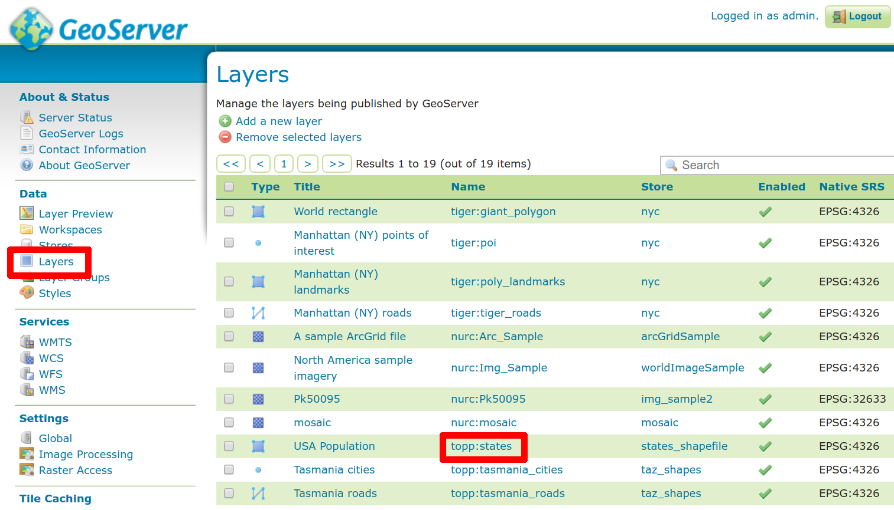
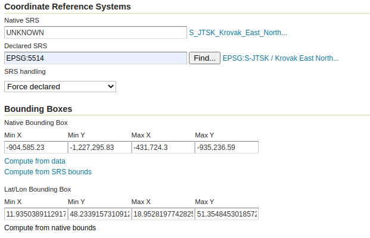
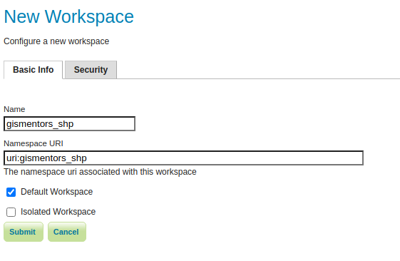
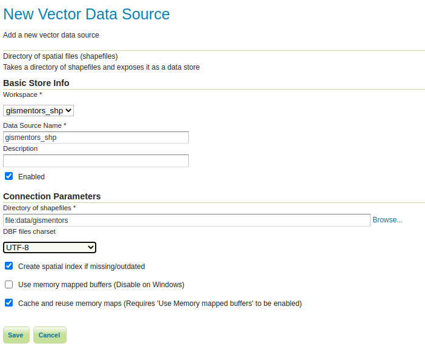
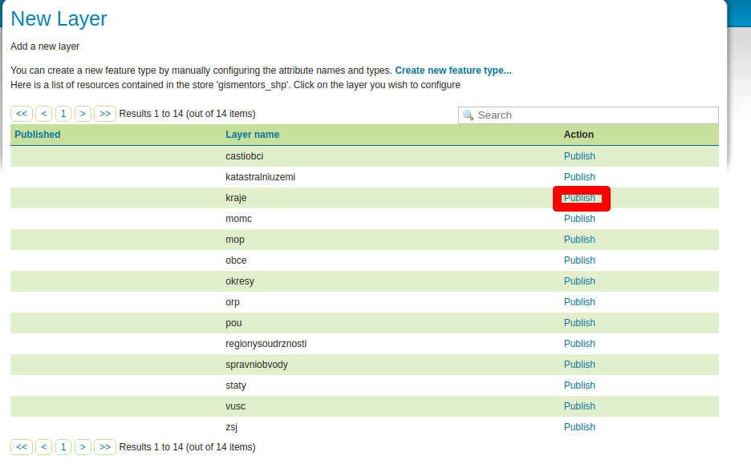

.. index::
   single: Definice vektoru

.. _definicev:

Definice vektorových dat
------------------------

Vektorová vrstva se definuje pomocí popisu dat. Seznam vrstev získáme pomocí
odkazu `Layers` v sekci `Data`.

   Seznam vrstev.

V seznamu vrstev vidíme u každé vrstvy její typ, úložiště a souřadnicový systém.
Pokud následně zvolíme vrstvu `states` dostáváme se ke konfiguraci vektorové vrstvy.

Identifikace
============

V rámci identifikace je povinné zadat pouze název vrstvy. Vhodné je ale uvést i popis vrstvy
a abstrakt vrstvy. Název vrstvy (name) je technickou identifikací vrstvy. Popis (`title`) a `abstrakt` je
určen ke čtení lidskému uživateli služby.

.. note:: Povinné položky jsou označeny červeným kolečkem. Položky, které je vhodné doplnit jsou označeny zeleným kolečkem.

.. figure:: images/data1.png

   Identifikace vektorové vrstvy.
   
Další metadata a souřadnicové systémy
=====================================
   
V další části popisu vrstvy je vhodné uvést klíčová slova, popisující data
a pokud je to možné, pak link na metadata dle normy ISO nebo FGDC.

Povinně je nutné uvést deklarovaný souřadnicový systém (`Declared SRS`).
Tento se specifikuje s využitím databáze `EPSG`. Např. systém `WGS84` má kód `EPSG:4326`.

.. figure:: images/data2.png

   Další metadata a souřadnicové systémy.

   
Ohraničující obdélník
=====================
   
V další části popisu vrstvy je nutné uvést ohraničující obdélník (`BBOX`) vrstvy.
`BBOX` musí být uveden jak v `deklarovaném SRS` tak v `Lat/Lon` souřadnicích.
K vytvoření pomohou odkazy `Compute from data` a `Compute from native bounds`.

.. figure:: images/data3.png

   BBOX

Přidání nové vrstvy z úložiště ESRI Shapefile
=============================================

Klikneme na `Add a new resource` a vybereme si úložiště z kterého chceme přidat vrstvu. Geoserver nám nabídne seznam vrstev, které můžeme přidat. Vrstvy, které nebyly ještě použité mají ve sloupci `Action` napsané `Publish`. Po kliknutí se dostaneme do okna Edit Layer, které bylo popsané na začátku této kapitoly.

.. figure:: images/new_layer_shp.png

   Přidání nové vrstvy z úložiště ESRI Shapefile 

.. note:: Každá vrstva může být publikovaná jenom jednou. Když klikneme na `Publish again` tak přepíšeme už vypublikovanou vrstvu.

Přidání nové vrstvy z úložiště PostGIS
=============================================

Po kliknutí na `Add a new resource` a výběre úložiště, z kterého chceme přidat vrstvu, máme u PostGIS úložiště dvě možnosti. První možnost je stejná jako u ESRI Shapefile úložiště přes Publish. Druhá možnost je publikovat vytvořený SQL pohled. Tuto možnost získáme po kliknutí na Configure new SQL view... .

View Name 
^^^^^^^^^^
Jméno publikované vrstvy

SQL statement
^^^^^^^^^^^^^
Místo na napsání SQL dotazu. Na konci dotazu nepíšeme znak ;

Například můžeme sestavit pohled, který vybere parcely v základní sídelní jednotce v Praze nazvané Baba s kódem 129470.

.. code-block:: sql

  SELECT p.geom, p.zpusobyvyuzitipozemku 
  FROM ruian_praha.parcely p 
  JOIN ruian_praha.zsj z 
  ON ST_Intersects(p.geom, z.geom) 
  WHERE z.kod = 129470

.. note:: Pohledy je také možno parametrizovat a vytvářet tak dynamicky výstupy z databáze včetně animací.
Parametry se zadávají do procent přímo do SQL. Např. AND ST_Area(p.geom) > %MIN_AREA%
Tomu se věnuje školení pro pokročilé.

SQL view parameters
^^^^^^^^^^^^^^^^^^^
Slouží na definování možností filtrování.

Attributes
^^^^^^^^^^
Zde se nám po kliknutí na Refresh zobrazí seznam atributů. U sloupce s geometrii můžeme určit souřadnicový systém. Taky tady zadefinujeme, který atribut je identifikátor.

Po kliknutí na Save se dostaneme na okno Edit Layer.

.. figure:: images/new_layer_postgis.png

   Přidání nove vrstvy z uložiště PostGIS 

S-JTSK
======
Opakovaně se můžete v různých verzích GeoServeru setkat s problémy při publikování geodat v prostorovém referenčním systému S-JTSK označeném kódem EPSG:5514. V případě, že GeoServer nevypočítá korektně souřadnice ohraničujícího obdélníka pro Lat/Lon, případně chybně identifikuje souřadnicový systém, je možné přepsat jeho definici.

Přepsání se realizuje pomocí deklarace v souboru :download:`epsg_overrides.properties <epsg_overrides.properties>`. Tento soubor se umisťuje do adresáře :file:`data_dir/user_projections`. Pro aktivování je nutné server restartovat.
 
.. note:: Pokud chceme přidat systém, který není nakonfigurován, pak deklaraci umisťujeme do souboru :file:`epsg.properties`. Na stránce `epsg.io <http://epsg.io/>`_ si najdeme definici vybraného souřadnicového systému pro Geoserver. Text vykopírujeme a přidáme ho do souboru :file:`epsg.properties`. Změna se projeví po restartování Geoserveru.

Úkoly
=====

ESRI Shapefile
^^^^^^^^^^^^^^

Vypublikujte vrstvu :map:`kraje` z `datové sady GISMentors
<http://training.gismentors.eu/geodata/qgis/data.zip>`__. Vrstvu
nakopírujte do adresáře :file:`data_dir/data/gismentors`.

.. note:: Tento adresář neexistuje, musíte jej vytvořit.

Pak vytvořte nový Worskspace a nový Storage.

PostGIS pohled
^^^^^^^^^^^^^^

Vytvořte pohled na data z PostGIS který vybere parcely v základní sídelní jednotce v Praze nazvané Baba s kódem 129470. Vytvořte styl, který klasifikuje parcely dle způsobu využití.

Řešení úkolů
============

Vrstva kraje_pseudo
^^^^^^^^^^^^^^^^^^^

Pokud jste data nakopírovali správně, pak v rámci definice vrstvy musíte pouze nastavit `Declared SRS` na `EPSG:4326` a spočítat BBOX.

   Nastavení BBOX a SRS pro kraje_pseudo.
   
Předtím však musíte projít kroky vytvoření `Workspace` (nepovinné) a `Store` (povinné).

   Nový pracovní prostor cr.

.. note:: Prostor můžete zvolit jako `Default`. Vše pak od této chvíle bude realizováno v tomto prostoru.

.. figure:: images/storeshp.png

   Typy úložišť.

   Úložiště cr-shp-wgs84.

.. note:: U úložiště můžete zvolit `kódování diakritiky`, kvůli popiskům v mapě.

   Seznam vrstev v úložišti cr-shp-wgs84.

PostGIS pohled
^^^^^^^^^^^^^^

Pomocí Create new view vytvoříme pohled parcely_baba. Jako definici zadáme

.. code-block:: sql

  SELECT p.geom, p.zpusobyvyuzitipozemku 
  FROM ruian_praha.parcely p 
  JOIN ruian_praha.zsj z 
  ON ST_Intersects(p.geom, z.geom) 
  WHERE z.kod = 129470

Následně sestavíme styl a přiřadíme k vrstvě.

.. code-block:: xml

   <?xml version="1.0" encoding="UTF-8"?>
   <StyledLayerDescriptor xmlns="http://www.opengis.net/sld" 
    xmlns:ogc="http://www.opengis.net/ogc" 
    xmlns:xsi="http://www.w3.org/2001/XMLSchema-instance" version="1.1.0" 
    xmlns:xlink="http://www.w3.org/1999/xlink" 
    xsi:schemaLocation="http://www.opengis.net/sld 
    http://schemas.opengis.net/sld/1.1.0/StyledLayerDescriptor.xsd" 
    xmlns:se="http://www.opengis.net/se">
   <NamedLayer>
    <se:Name>QueryLayer</se:Name>
    <UserStyle>
      <se:Name>QueryLayer</se:Name>
      <se:FeatureTypeStyle>
        <se:Rule>
          <se:Name>12</se:Name>
          <se:Description>
            <se:Title>12</se:Title>
          </se:Description>
          <ogc:Filter xmlns:ogc="http://www.opengis.net/ogc">
            <ogc:PropertyIsEqualTo>
              <ogc:PropertyName>zpusobyvyuzitipozemku</ogc:PropertyName>
              <ogc:Literal>12</ogc:Literal>
            </ogc:PropertyIsEqualTo>
          </ogc:Filter>
          <se:PolygonSymbolizer>
            <se:Fill>
              <se:SvgParameter name="fill">#74ddef</se:SvgParameter>
            </se:Fill>
            <se:Stroke>
              <se:SvgParameter name="stroke">#000001</se:SvgParameter>
              <se:SvgParameter name="stroke-width">1</se:SvgParameter>
              <se:SvgParameter name="stroke-linejoin">bevel</se:SvgParameter>
            </se:Stroke>
          </se:PolygonSymbolizer>
        </se:Rule>
        <se:Rule>
          <se:Name>16</se:Name>
          <se:Description>
            <se:Title>16</se:Title>
          </se:Description>
          <ogc:Filter xmlns:ogc="http://www.opengis.net/ogc">
            <ogc:PropertyIsEqualTo>
              <ogc:PropertyName>zpusobyvyuzitipozemku</ogc:PropertyName>
              <ogc:Literal>16</ogc:Literal>
            </ogc:PropertyIsEqualTo>
          </ogc:Filter>
          <se:PolygonSymbolizer>
            <se:Fill>
              <se:SvgParameter name="fill">#8ee9c0</se:SvgParameter>
            </se:Fill>
            <se:Stroke>
              <se:SvgParameter name="stroke">#000001</se:SvgParameter>
              <se:SvgParameter name="stroke-width">1</se:SvgParameter>
              <se:SvgParameter name="stroke-linejoin">bevel</se:SvgParameter>
            </se:Stroke>
          </se:PolygonSymbolizer>
        </se:Rule>
        <se:Rule>
          <se:Name>17</se:Name>
          <se:Description>
            <se:Title>17</se:Title>
          </se:Description>
          <ogc:Filter xmlns:ogc="http://www.opengis.net/ogc">
            <ogc:PropertyIsEqualTo>
              <ogc:PropertyName>zpusobyvyuzitipozemku</ogc:PropertyName>
              <ogc:Literal>17</ogc:Literal>
            </ogc:PropertyIsEqualTo>
          </ogc:Filter>
          <se:PolygonSymbolizer>
            <se:Fill>
              <se:SvgParameter name="fill">#dd7be2</se:SvgParameter>
            </se:Fill>
            <se:Stroke>
              <se:SvgParameter name="stroke">#000001</se:SvgParameter>
              <se:SvgParameter name="stroke-width">1</se:SvgParameter>
              <se:SvgParameter name="stroke-linejoin">bevel</se:SvgParameter>
            </se:Stroke>
          </se:PolygonSymbolizer>
        </se:Rule>
        <se:Rule>
          <se:Name>19</se:Name>
          <se:Description>
            <se:Title>19</se:Title>
          </se:Description>
          <ogc:Filter xmlns:ogc="http://www.opengis.net/ogc">
            <ogc:PropertyIsEqualTo>
              <ogc:PropertyName>zpusobyvyuzitipozemku</ogc:PropertyName>
              <ogc:Literal>19</ogc:Literal>
            </ogc:PropertyIsEqualTo>
          </ogc:Filter>
          <se:PolygonSymbolizer>
            <se:Fill>
              <se:SvgParameter name="fill">#e969a5</se:SvgParameter>
            </se:Fill>
            <se:Stroke>
              <se:SvgParameter name="stroke">#000001</se:SvgParameter>
              <se:SvgParameter name="stroke-width">1</se:SvgParameter>
              <se:SvgParameter name="stroke-linejoin">bevel</se:SvgParameter>
            </se:Stroke>
          </se:PolygonSymbolizer>
        </se:Rule>
        <se:Rule>
          <se:Name>20</se:Name>
          <se:Description>
            <se:Title>20</se:Title>
          </se:Description>
          <ogc:Filter xmlns:ogc="http://www.opengis.net/ogc">
            <ogc:PropertyIsEqualTo>
              <ogc:PropertyName>zpusobyvyuzitipozemku</ogc:PropertyName>
              <ogc:Literal>20</ogc:Literal>
            </ogc:PropertyIsEqualTo>
          </ogc:Filter>
          <se:PolygonSymbolizer>
            <se:Fill>
              <se:SvgParameter name="fill">#dec26e</se:SvgParameter>
            </se:Fill>
            <se:Stroke>
              <se:SvgParameter name="stroke">#000001</se:SvgParameter>
              <se:SvgParameter name="stroke-width">1</se:SvgParameter>
              <se:SvgParameter name="stroke-linejoin">bevel</se:SvgParameter>
            </se:Stroke>
          </se:PolygonSymbolizer>
        </se:Rule>
        <se:Rule>
          <se:Name>21</se:Name>
          <se:Description>
            <se:Title>21</se:Title>
          </se:Description>
          <ogc:Filter xmlns:ogc="http://www.opengis.net/ogc">
            <ogc:PropertyIsEqualTo>
              <ogc:PropertyName>zpusobyvyuzitipozemku</ogc:PropertyName>
              <ogc:Literal>21</ogc:Literal>
            </ogc:PropertyIsEqualTo>
          </ogc:Filter>
          <se:PolygonSymbolizer>
            <se:Fill>
              <se:SvgParameter name="fill">#7792e0</se:SvgParameter>
            </se:Fill>
            <se:Stroke>
              <se:SvgParameter name="stroke">#000001</se:SvgParameter>
              <se:SvgParameter name="stroke-width">1</se:SvgParameter>
              <se:SvgParameter name="stroke-linejoin">bevel</se:SvgParameter>
            </se:Stroke>
          </se:PolygonSymbolizer>
        </se:Rule>
        <se:Rule>
          <se:Name>23</se:Name>
          <se:Description>
            <se:Title>23</se:Title>
          </se:Description>
          <ogc:Filter xmlns:ogc="http://www.opengis.net/ogc">
            <ogc:PropertyIsEqualTo>
              <ogc:PropertyName>zpusobyvyuzitipozemku</ogc:PropertyName>
              <ogc:Literal>23</ogc:Literal>
            </ogc:PropertyIsEqualTo>
          </ogc:Filter>
          <se:PolygonSymbolizer>
            <se:Fill>
              <se:SvgParameter name="fill">#72da6c</se:SvgParameter>
            </se:Fill>
            <se:Stroke>
              <se:SvgParameter name="stroke">#000001</se:SvgParameter>
              <se:SvgParameter name="stroke-width">1</se:SvgParameter>
              <se:SvgParameter name="stroke-linejoin">bevel</se:SvgParameter>
            </se:Stroke>
          </se:PolygonSymbolizer>
        </se:Rule>
        <se:Rule>
          <se:Name>26</se:Name>
          <se:Description>
            <se:Title>26</se:Title>
          </se:Description>
          <ogc:Filter xmlns:ogc="http://www.opengis.net/ogc">
            <ogc:PropertyIsEqualTo>
              <ogc:PropertyName>zpusobyvyuzitipozemku</ogc:PropertyName>
              <ogc:Literal>26</ogc:Literal>
            </ogc:PropertyIsEqualTo>
          </ogc:Filter>
          <se:PolygonSymbolizer>
            <se:Fill>
              <se:SvgParameter name="fill">#a1cf4b</se:SvgParameter>
            </se:Fill>
            <se:Stroke>
              <se:SvgParameter name="stroke">#000001</se:SvgParameter>
              <se:SvgParameter name="stroke-width">1</se:SvgParameter>
              <se:SvgParameter name="stroke-linejoin">bevel</se:SvgParameter>
            </se:Stroke>
          </se:PolygonSymbolizer>
        </se:Rule>
        <se:Rule>
          <se:Name>27</se:Name>
          <se:Description>
            <se:Title>27</se:Title>
          </se:Description>
          <ogc:Filter xmlns:ogc="http://www.opengis.net/ogc">
            <ogc:PropertyIsEqualTo>
              <ogc:PropertyName>zpusobyvyuzitipozemku</ogc:PropertyName>
              <ogc:Literal>27</ogc:Literal>
            </ogc:PropertyIsEqualTo>
          </ogc:Filter>
          <se:PolygonSymbolizer>
            <se:Fill>
              <se:SvgParameter name="fill">#9264e6</se:SvgParameter>
            </se:Fill>
            <se:Stroke>
              <se:SvgParameter name="stroke">#000001</se:SvgParameter>
              <se:SvgParameter name="stroke-width">1</se:SvgParameter>
              <se:SvgParameter name="stroke-linejoin">bevel</se:SvgParameter>
            </se:Stroke>
          </se:PolygonSymbolizer>
        </se:Rule>
        <se:Rule>
          <se:Name></se:Name>
          <se:Description>
            <se:Title>NULL'</se:Title>
          </se:Description>
          <ogc:Filter xmlns:ogc="http://www.opengis.net/ogc">
            <ogc:PropertyIsNull>
              <ogc:PropertyName>zpusobyvyuzitipozemku</ogc:PropertyName>
            </ogc:PropertyIsNull>
          </ogc:Filter>
          <se:PolygonSymbolizer>
            <se:Fill>
              <se:SvgParameter name="fill">#d96452</se:SvgParameter>
            </se:Fill>
            <se:Stroke>
              <se:SvgParameter name="stroke">#000001</se:SvgParameter>
              <se:SvgParameter name="stroke-width">1</se:SvgParameter>
              <se:SvgParameter name="stroke-linejoin">bevel</se:SvgParameter>
            </se:Stroke>
          </se:PolygonSymbolizer>
        </se:Rule>
      </se:FeatureTypeStyle>
    </UserStyle>
   </NamedLayer>
   </StyledLayerDescriptor>
    
